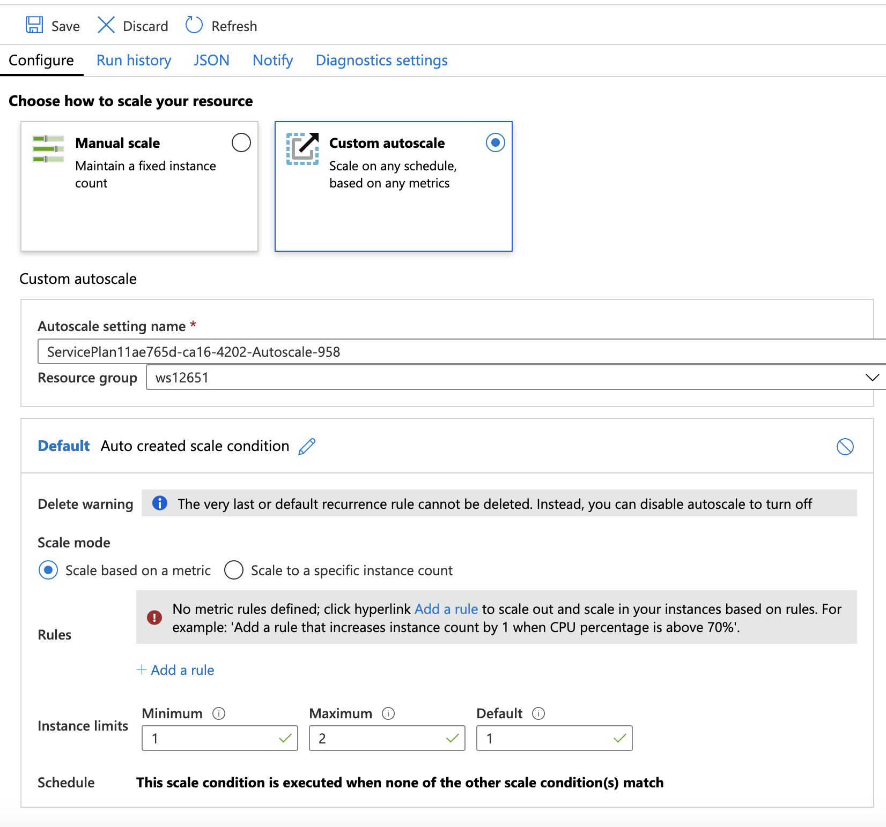
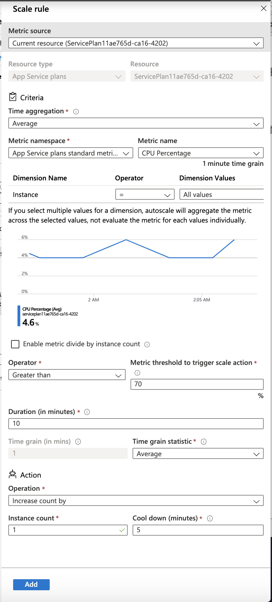
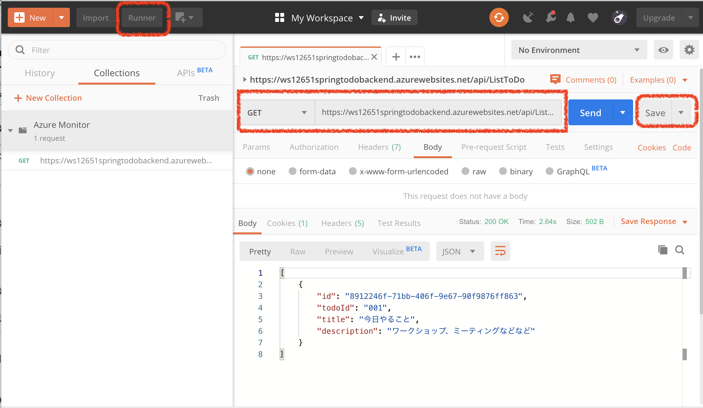

# パフォーマンスとスケジュールに基づく自動スケール

Azure Web App は、関連づけられたApp Service Planの定義によっていオートスケールが可能です。

#### (1) App Service Planの選択
Azure モニター画面の左Paneから[Autoscale]を選択して、オートスケール対象のリソースを選択します。

#### (2) スケール方法の概要を設定
スケール方法で　[カスタム自動スケーリング] /* custom auto scaling */ を選択します。

スケールモードで[メトリックに基づいてスケール] /* Scale based on a metric */ を選択します。

#### (3) ルールの追加

画面の下の方の [+規則を追加する] /* +Add a rule */ をクリックして、ルールの入力ダイアログを表示します。

#### (4) 規則の入力

現在のメトリックより少し CPU の使用率が高くなったら、自動スケールするように規則を設定します。

例えば、現在のCPUの使用率が5% ならば、閾値を8%にするなど。

* スケール操作のトリガー
 * 閾値 - CPUの使用率が8%より大きい
 * 期間（分）- 1

画面下部の[追加]ボタンをクリックします。

#### (5) アプリケーションに負荷をかける

##### Postman を利用する場合
[Postman](https://www.getpostman.com/postman)などを利用すると、繰り返し実行などができて便利です。

PostmanでGET呼び出しの設定後、画面右上のSaveボタンでCollectionを保存します。保存後、画面左上の[Runner]ボタンをクリックして、繰り返し実行するための設定を行い、Web Appに負荷をかけます

#### (6) スケールを確認
App Service Planを確認して、インスタンスが1から２に増えていることを確認します。

[Agenda](./agenda.md)
