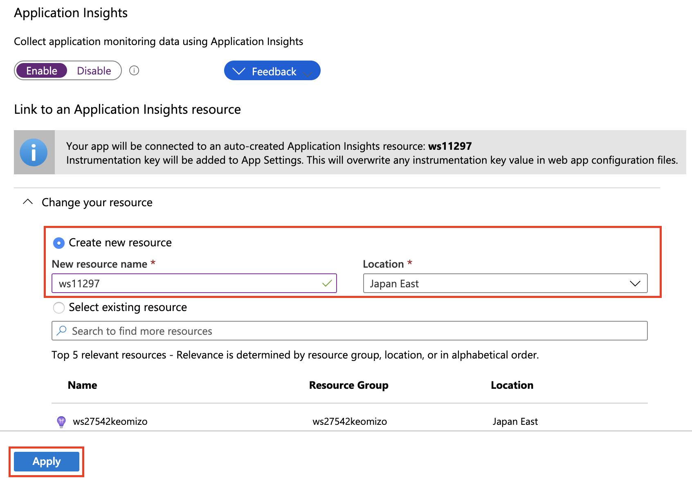
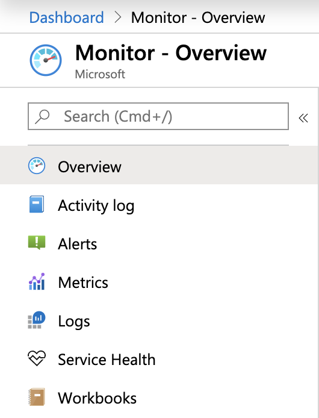
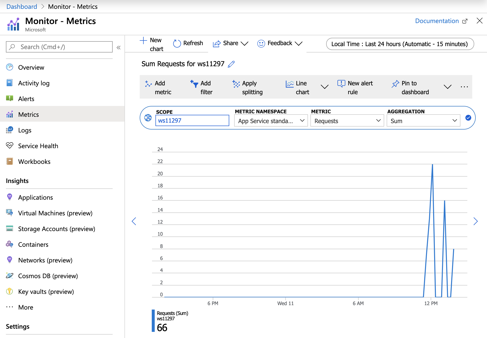
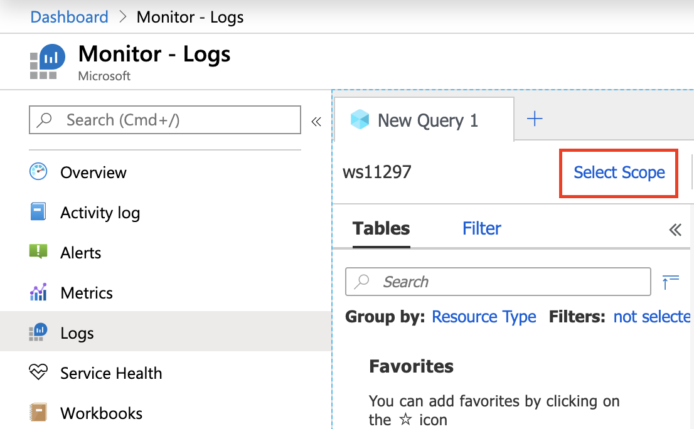
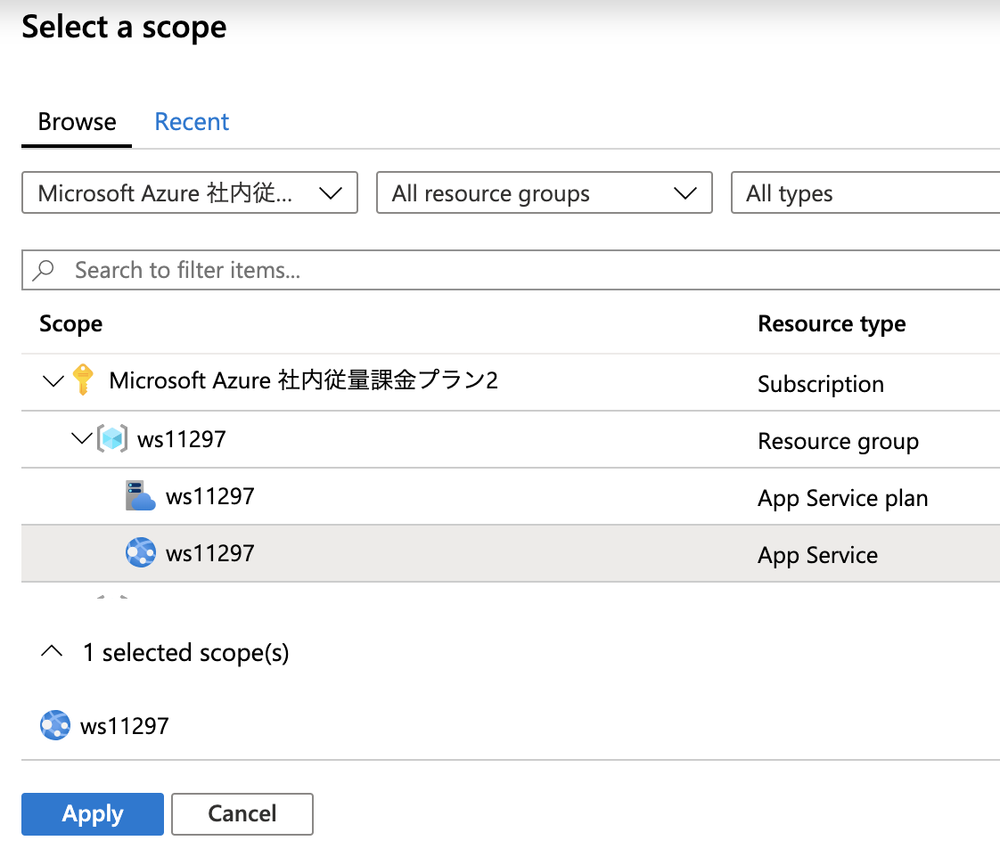
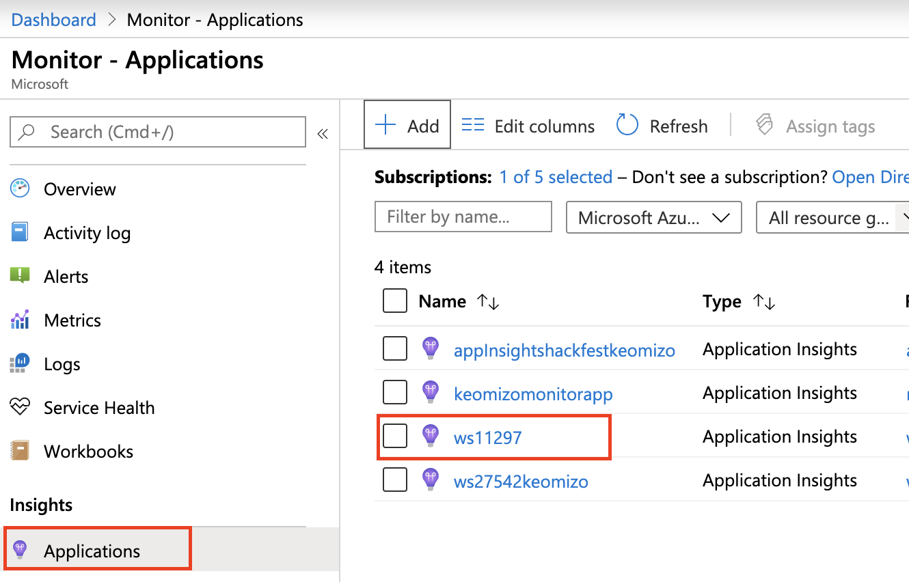
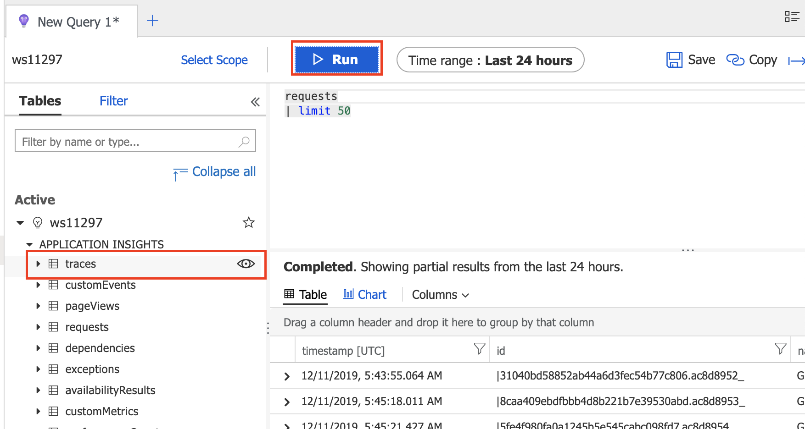

# Azure Monitor / App Insightsの基本的な設定

ここでは、静的なWebサイトをデプロイし、Azure MonitorとApplication Insightsの基本的な操作を行います。

----
## ステップ1. 静的Webサイトのデプロイ

Azure App Service で、静的Webサイトを作成しApplication Insightsで監視できるようにします。

### 1. App Serviceのデプロイ


##### (1) Location、App Nameを環境変数に設定
bashの例）　値は適宜変更してください。
```
export REGION="japaneast"
export PREFIX="ws$RANDOM$RANDOM"
export RGNAME="$PREFIX"
export INSIGHTSWEB="$PREFIX"
```

##### (2) Web Appの作成

サンプルアプリケーションの Git リポジトリを指定してアプリケーションをデプロイします。

```
az group create --name $RGNAME  -l $REGION
az appservice plan create -g $RGNAME -n $PREFIX -l $REGION  --sku FREE
az webapp create -g $RGNAME -n $PREFIX -p $PREFIX --deployment-source-url https://github.com/Azure-Samples/html-docs-hello-world.git
```


出力結果の抜粋
```
... 中略 ...
You can launch the app at http://ws0000hello.azurewebsites.net
... 中略 ...
```

##### (3) Web App の動作確認
出力されたURLにブラウザでアクセスして、正しくデプロイされていることを確認します。


### 2. Application Insightsの有効化

##### (1) 作成した静的WebサイトのWebAppを選択
Azure ポータルにログインします。
作成した静的WebサイトのWebAppを選択します。

##### (2) Application Insightsの有効化
左PaneでSettingsカテゴリの[Application Insights]をクリックします。

右Paneで[Turn on Application Insights]をクリックします。

右Paneで[Create new resource]のラジオボタンをチェックし、画面下部の[Apply]をクリックします。



##### (5) App Serviceの再起動
Application Insightsの有効化を反映するために、App Serviceを再起動します。

左Paneの[Overview]をクリックして概要を表示します。
右Pane上部の[Restart]をクリックしてApp Serviceを再起動します。


### 3. Azure Monitor の利用

デプロイしたアプリケーションにブラウザで何回かアクセスしておきます。

##### (1) Azure Monitorの画面を表示
Azureポータル画面の左側のメニューで[Monitor]をクリックします。

##### (2) メトリクスの表示
Azure Monitor画面の左Paneのメニューから[Metrics]を選択します。


##### (3) メトリクスチャートの設定

Azure Monitor画面の右Paneで、表示するメトリクスのSCOPE, METRIC, AGGREGATIONを選択します。


ここでは
* SCOPE : 静的WebサイトのApp AppService
* METRIC : Http 2xx
を選択します。


メトリクスの項目を追加する場合は、Azure Monitor画面の右Pane上部の[Add metric]をクリックして、項目を追加します。

##### (4) ダッシュボードに貼り付け
Azure Monitor画面の右Pane上部の[Pin to dashboard]をクリックして、プルダウンメニューから[Select another dashboard]を選択します。

Pin to another dashboardのダイアログで[Create new]のタブを選択し、ダッシュボード名、サブスクリプションを選択し[Apply]をクリックします。

##### (5) ログの表示スコープ設定
Azure Monitor画面の左Paneのメニューから[Logs]を選択します。

Azure Monitor画面の右Paneに表示されたNew Queryタブ上部の[Select Scope]をクリックし、スコープ選択のダイアログを表示します。



Select Scopeのダイアログで、作成した静的WebサイトのApp Serviceを選択し[Apply]をクリックします。




##### (6) AzureActivityログの表示
Azure Monitor画面の右Paneに表示されたNew QueryタブのAppServiceカテゴリの[Azure Activity]にマウスカーソルを合わせ、文字の右側に表示されるアイコン（目のような形）をクリックします。

表示されたダイアログの[See in query editor]をクリックし、クエリエディタにクエリを反映します。

クエリの上部の[>Run]をクリックして、アクティビティログを確認します。


### Application Insightsの利用

##### (1)Azure Monitorの画面を表示
Azureポータル画面の左側のメニューで[Monitor]をクリックします。

##### (2) Application Insightsの選択
Azure Monitor画面の左PaneのメニューでInsightsセクションの[Applications]をクリックします。右Paneの一覧から、先ほど作成したApplication Insightsを選択します。




##### (3) Investigation の表示

Application Insights画面の左PaneのメニューでInvesitigateセクションのPerformanceを選択し、右Paneに表示された結果を確認します。


##### (4) Log(Analytics)の表示

Application Insights画面の左PaneのメニューでMonitoringセクションの[Log(Analytics)]をクリックします。

Application Insights画面の右Paneで APPLICATION INSIGHTSの一覧の[trace]にマウスカーソルを合わせ、文字の右に表示されるアイコン（目の形）をクリックし、クエリーを反映します。

画面上部の[>Run]をクリックして、クエリを実行します




```

[Agenda](./agenda.md) | [Next](./deploySampleApp.md)
