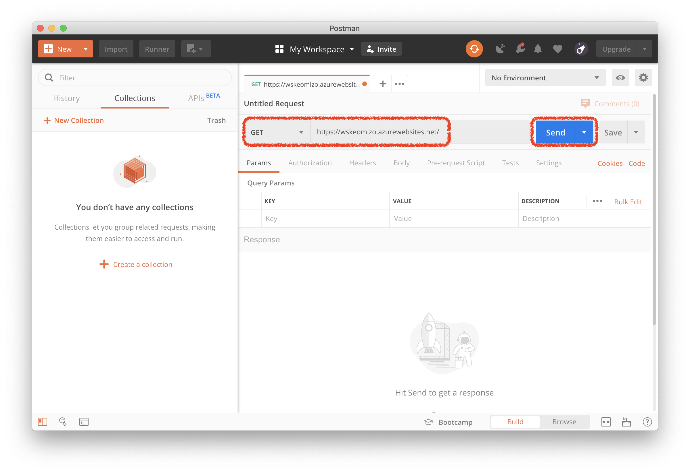
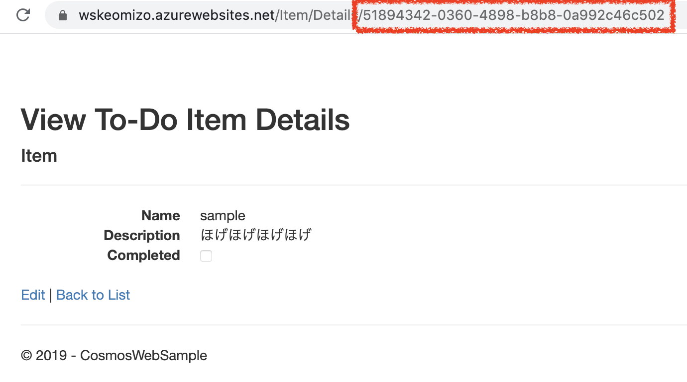
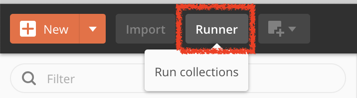
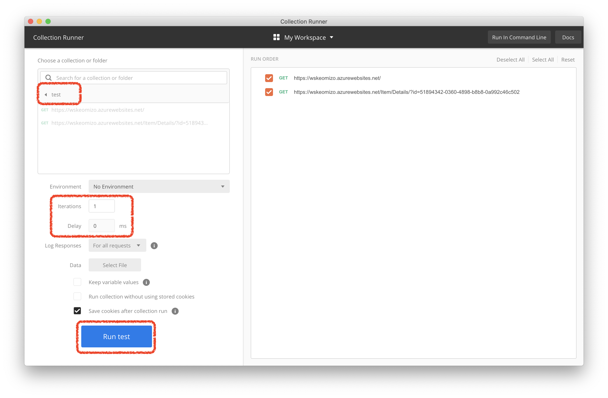

# Execute sample application.

## Step 1. Install postman

#### 1. Download and install postman

https://www.getpostman.com/

#### 2. Launch Postman

## Step 2. call application from  Postman

#### 1. Access WebApp Index page

1. Click [+] in the right pane and create new request tab.

2. Select `GET` method and input Your Web App URL. (e.g. _https://ws12345678.azurewebsites.net/_)

3. Click [Send]

#### 2. Access WebApp Item Detail Page

1. Access WebApp from Browser

2. Click [Details] link from List

3. Copy item id from Browsers URL Field.

4. Back to Postman GUI and Click [+] in the right pane and reate new request tab

5. Select `GET` method and Input `[YOUR WEB APP URL]/Item/Details` (e.g. _https://ws12345678.azurewebsites.net/Item/Details_)

6. Input query parameter. Key is ID, Value is ItemId is checked last task.

7. Click [Send]

#### 3. Access WebApp Force Error page

1. Click [+] in the right pane and create new request tab.

2. Select `GET` method and input URL `[YOUR WEBAPP URL]/Item/ForceError` (e.g. _https://ws12345678.azurewebsites.net/Item/ForceError_)

3. Click [Send]

## Step3. Call API sequentially

1. Click [+ New Collection] in the left pane.

2. Input `test' to Name field  and click [Create] button in the right bottom.

3. Click [Save] button in the right pane.

4. Scroll down on 'SAVE REQUEST' Dialog

5. Select collection name and click [Save test] bottom in rigth bottom.

Repeat 3-5 operation in each Request tabs.

6. Click [Runner] button in the left above.

7. Select `test` collection and Input iterations and Delay.

8. Click [Run test] button.

[Agenda](./agenda.md) | [Next](./monitoringException.md)
