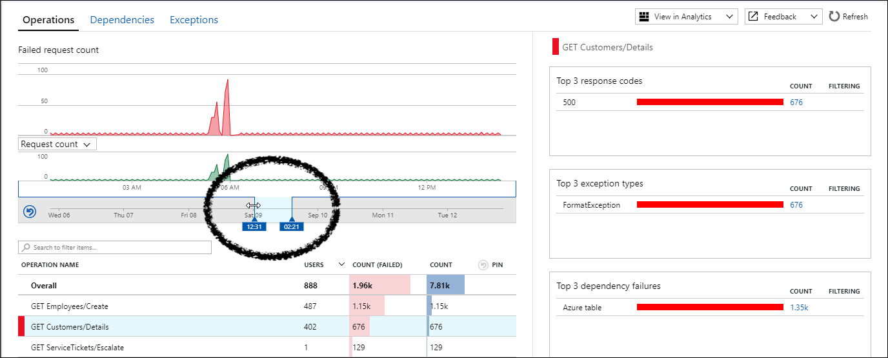

# Find run-time exceptions

Find and diagnose run-time exception with Azure Application Insights.

> Application Insightsを利用して、アプリケーションの例外の発生回数や時間、また、その内容を確認します。

#### (1) Show Application Insight 

Logged into Azure Portal and choose [Monitor] on left pane.

On left pane of Azure Monitor view, choose [Application] under Insights section.

Choose target Application Insights resources from Application Insights List.

> Azureポータル画面にログインし、左Paneのメニューから[Monitor]を選択します。
>
> Azure Monitor画面の左PaneのInsightsセクションの[Application]を選択します。
>
> Application Insights一覧から、対象のApplication Insightsを選択します。

#### (2) Display Failures

On right pane of Application Insights View, choose [Failure]. or choose [Overview] and click [Failed requests graph].

> Application Insightsの画面の右Paneで [Failure] を選択する。または、Overviewの画面で [Failed requests] のグラフをクリックします。

#### (3) Modify time range

Reduce the time window to zoom in on the period where the failure rate shows a spike.

> タイムウィンドウをドラッグすることで、表示するタイムレンジを変更します。

#### (4) Display failures list 

At 'OPERATION NAME" list On the center pane, choose target operation to examine.

Next, click [Drill into...] button on the botom of righst pane,and then how the list of error.

> 真ん中のPaneのPaneの"OPERATION NAME"の一覧で、確認したい操作を選択します。次に、右Pane下部のDrill into... の下のボタンをクリックして、エラーの一覧を表示します。
> エラー一覧から、エラーをクリックすると JavaのExceptionなどの詳細を参照できます。

[Agenda](./agenda.md) | [Next](./monitoringPerformance.md)
